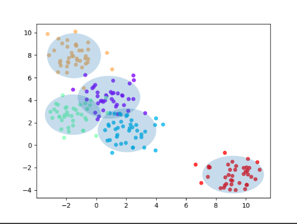

# Lab 3: Bayes Classifiers

## Assignment 1


## Assignment 3 
### Data: Vowels


#### Output
```
Trial: 0 Accuracy 61
Trial: 10 Accuracy 66.2
Trial: 20 Accuracy 74
Trial: 30 Accuracy 66.9
Trial: 40 Accuracy 59.7
Trial: 50 Accuracy 64.3
Trial: 60 Accuracy 66.9
Trial: 70 Accuracy 63.6
Trial: 80 Accuracy 62.3
Trial: 90 Accuracy 70.8
Final mean classification accuracy  64.7 with standard deviation 4.03
```
### Data: Iris

#### Output
```
Trial: 0 Accuracy 84.4
Trial: 10 Accuracy 95.6
Trial: 20 Accuracy 93.3
Trial: 30 Accuracy 86.7
Trial: 40 Accuracy 88.9
Trial: 50 Accuracy 91.1
Trial: 60 Accuracy 86.7
Trial: 70 Accuracy 91.1
Trial: 80 Accuracy 86.7
Trial: 90 Accuracy 91.1
Final mean classification accuracy  89 with standard deviation 4.16
```
### Questions
1) A feature independence assumption is reasonable for features that are not dependent on each other. For example in natural 
language there may be dependence between words, such as `new` and `york`. Naive Bayes algorithm works well
   in some cases even if there is dependence, but as long as the features are not correlated.
2) The purple data points seem to be classified correctly, but the red and green data point are not. The line should have been formed more 
obliquely to the right to make the classification better. SVM would produce better classification in that situation (with linear kernel).
## Assignment 4-5
### Data: Iris

### Output
```
Trial: 0 Accuracy 95.6
Trial: 10 Accuracy 100
Trial: 20 Accuracy 93.3
Trial: 30 Accuracy 91.1
Trial: 40 Accuracy 97.8
Trial: 50 Accuracy 93.3
Trial: 60 Accuracy 93.3
Trial: 70 Accuracy 97.8
Trial: 80 Accuracy 95.6
Trial: 90 Accuracy 93.3
Final mean classification accuracy  94.7 with standard deviation 2.82
```

### Data: Vowel

### Output
```
Trial: 0 Accuracy 76.6
Trial: 10 Accuracy 86.4
Trial: 20 Accuracy 83.1
Trial: 30 Accuracy 80.5
Trial: 40 Accuracy 72.7
Trial: 50 Accuracy 76
Trial: 60 Accuracy 81.8
Trial: 70 Accuracy 82.5
Trial: 80 Accuracy 79.9
Trial: 90 Accuracy 83.1
Final mean classification accuracy  80.2 with standard deviation 3.52
```
### Questions
1) Yes both of the datasets were improved by the boosting. Both the `Vowel` and `Iris` data has a lot of variance and therefore the improvements are significantly noticeable.
2) Most of the line is not that complex, but there is a cup-form in the middle that separates the data better (more complex).  
3) Considering this case yes, the accuracy of the classification improved, and the standard deviation reduced. Boosting has some advantages over
other types of models, which is that it does not increase the dimensionality, like for example SVM. Increasing 
   dimensionality is computationally cumbersome with phenomena such as curse of dimensionality. 
   The Adaboost-algorithm invokes the weak learning algorithm (BayesClassifier) and for each iteration updates 
   the training data instances by: Adding more weight to the misclassified instances. This increases 
   the importance of the misclassified instances in next iteration. All the weights sum up to one.
## Assignment 6
1) The Decision-Tree-Classifier showed improvement in the accuracy and slightly with the standard deviation after boosting. Accuracy increased from 92.4 to 94.6 and
   standard deviation decreased from 3.71 to 3.67. 
2) The boundary is still stiff, but with some indents to match the instances. The complexity of the boundary has not 
   increased dramatically. 
3) Boosting can make up for not using a more advanced model in the basic classifier, since the accuracy is pretty high. 

## Assignment 7
* Boosting with outliers may result with over-fitting of the data, since the Adaboost algorithm focuses on the
  misclassified instances and gives them high importance.    
* Decision Trees handles irrelevant input much better since it chooses the instance that gives the most information gain.
* Depends on the input data. Boosting can as we saw in this lab improve the classification accuracy. 
* Decision trees can handle both categorical data and continuous, same as NB. The only difference is that NB does not seem to over-fit to the same extent as DT.
* Naive Bayes is much better with scalability, since the data is only passed once and there is no need for pruning.  


